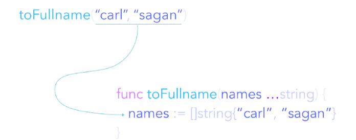

# Golang可变参函数
## 一个简单的可变参函数

在golang语言中，函数中传入的参数是不确定的，也就是可变的，通过如下方式实现：

```
func MergeName(names ...string) string {
  return strings.Join(name, "")
}
```

在使用MergeName这个函数时，可以不传或传更多的参数。

```
MergeName("James", "Wade", "Antony")
MergeName("Paul")
MergeName()
... ...
```

## 可变参函数使用场景
- 避免创建仅作传入参数用的临时切片
- 传入参数数量未知
- 增加函数可读性

## 实现逻辑
可变参函数会在内部创建一个“新的切片”。

