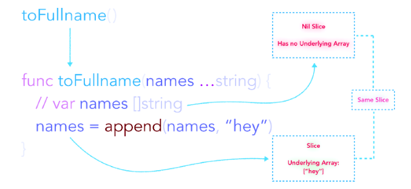

# Golang可变参函数
## 一个简单的可变参函数

在golang语言中，函数中传入的参数是不确定的，也就是可变的，通过如下方式实现：

```
func MergeName(names ...string) string {
  return strings.Join(name, "")
}
```

在使用MergeName这个函数时，可以不传或传更多的参数。

```
MergeName("James", "Wade", "Antony")
MergeName("Paul")
MergeName()
... ...
```

## 可变参函数使用场景
- 避免创建仅作传入参数用的临时切片
- 传入参数数量未知
- 增加函数可读性

## 实现逻辑
可变参函数会在内部创建一个“新的切片”。如下图所示：


当你不传入参数的时候，可变参数会变成一个空值切片(nil)。


## 传入切片
可以通过向一个已有的切片添加可变参数运算符 ”…“ 后缀的方式将其传入可变参数函数。
```
names := []string{"James", "Wade"}
MergeName(names...)
```
类似于：
```
MergeName("James", "Wade")
```

### 传入切片细节分析
在函数中传入一个人切片之后，函数不会重新创建一个切片，而是直接使用你传入的切片，也就是说传入的切片和函数内部使用的切片是共享同一个底层数组的。

如果在函数内部修改了这个切片，那个这个切片的原始数据也会被修改。

